### 2025년 GWNU 공학창의 캡스톤디자인 경진대회 우수상 수상

### [개발자]
윤원준 - 서버, 안드로이드 애플리케이션 제작 
강희준 - HW 및 라즈베리파이 프로그램 제작

### 주제: Smart Study Desk App (개인용 학습 관리 모듈 & 앱)

[시스템 구성도]
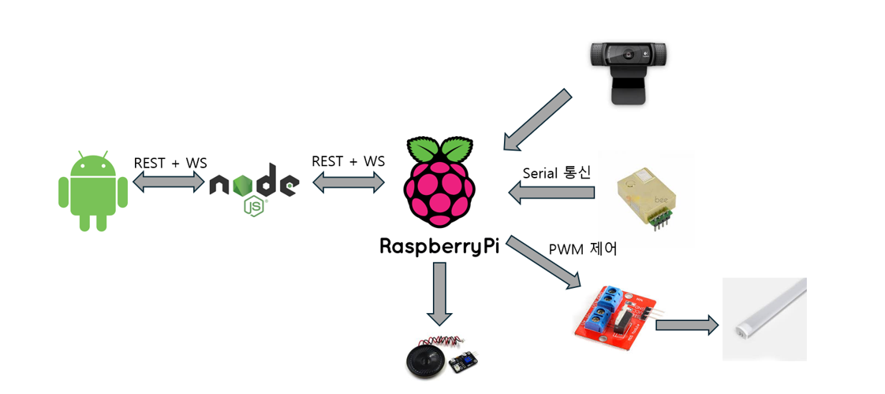
- 본 애플리케이션은 라즈베리파이 기반의 스마트 책상과 연동되어, 졸음 감지 및 CO₂ 농도 알림, 일정 관리 기능을 제공합니다.  

### 시스템 구성
- 📱 Android 앱 (Kotlin)
- 📡 Node.js 서버 (WebSocket 실시간 통신)
- 🍓 Raspberry Pi (OpenCV + CO₂ 센서)
- 💾 MySQL (Sequelize ORM 사용)

---

### E-R 다이어그램
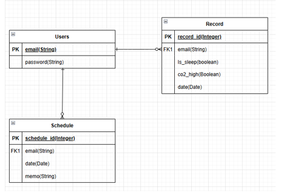

---

### 주요 기능

| 기능 | 설명 |
|------|------|
| **JWT 인증** | 로그인 시 JWT 발급 후 앱 내부 저장소에 저장, 앱 시작 시 자동 로그인 처리 |
| **졸음 감지** | Raspberry Pi에서 dlib 기반 눈 감김 감지 → WebSocket 통해 앱에 알림 표시 |
| **공기질 경고** | CO₂ 농도 기준 초과 시 환기 알림 송신 (WebSocket) |
| **환경 설정** | 앱에서 밝기 · 소리 제어 → 하드웨어 장치 연동 |
| **학습 일정 관리** | 캘린더에 메모 기록 → SharedPreferences + 서버 기록 동시 저장 |
| **학습 시작/종료 기록** | 앱 시작/종료를 서버에 기록|

---

### 실행 시나리오

1. 사용자가 애플리케이션에서 회원가입 / 로그인 시 서버를 거쳐 DB에 반영  
2. 서버에서 JWT 토큰을 발급하여 사용자의 애플리케이션에 저장  
3. 사용자가 라즈베리파이 모듈의 고유 번호를 애플리케이션에 입력 후, '등록' 버튼 클릭  
4. 애플리케이션에서 사용자 정보와 함께 고유번호를 담아 서버에 REST 요청을 전송  
5. 서버는 받은 정보를 매핑해 웹 소켓 객체로 생성하고, 해당 정보를 바탕으로 WebSocket 연결을 관리  
6. 사용자가 '학습 시작' 버튼 클릭  
7. 서버는 해당 사용자(이메일)와 매핑된 라즈베리파이 장치에 학습 시작 명령을 전송  
8. 라즈베리파이는 명령 수신 뒤 카메라 기반 졸음 감지 기능과 CO2 농도 측정 기능을 동시에 실행하여 집중 모드를 시작  
9. 라즈베리파이는 졸음 상태로 판단 시, 모듈 자체에서 경고음을 울리거나 LED를 동작시키고, 동시에 서버에 신호를 전송  
10. 서버는 졸음 감지 신호를 수신하면 애플리케이션으로 실시간 알림을 전송하고, 감지 기록을 DB에 저장  
11. 애플리케이션에서 경고음 사용 여부 및 LED 밝기를 조절하면, 해당 신호는 서버를 거쳐 라즈베리파이에 실시간 반영  
12. 사용자가 '학습 종료하기' 버튼을 클릭하면, 서버는 라즈베리파이에 종료 명령을 전송하여 모니터링을 중단

---

### 주요 코드

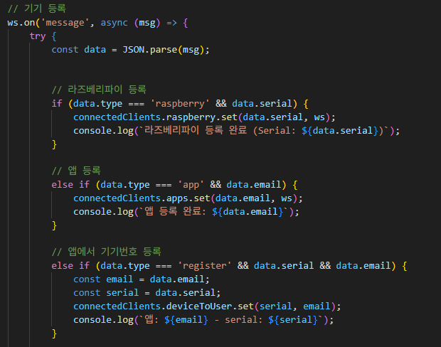

- WebSocket 연결 시 메시지 타입에 따라 클라이언트 역할을 분리
- Raspberry Pi, App을 각각 독립적으로 관리
- 사용자가 앱에서 기기번호를 등록하면 serial ↔ email 매핑 저장
- 서버가 실시간 제어 및 이벤트 중계의 허브 역할 수행
- 학습 시작 시, 서버는 해당 기기의 WebSocket을 조회하여 start 명령 전송

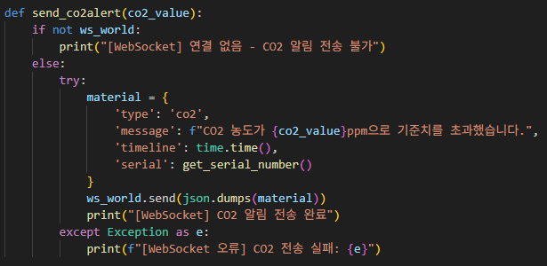
- EAR 값이 임계치 이하로 ALERT_DURATION 이상 유지되면 호출
- 졸음 감지 알고리즘 결과를 즉시 서버로 송신
- 서버는 사용자 이메일과 매핑된 앱에 알림 전달

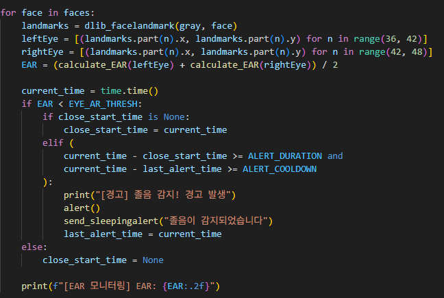
- dlib의 68-point facial landmark 모델을 이용하여 양쪽 눈의 EAR(Eye Aspect Ratio)를 계산
- EAR 값이 개인별 임계치 이하로 일정 시간(ALERT_DURATION) 이상 유지될 경우 졸음 상태로 판단
- 단순 눈 깜빡임으로 인한 오탐지를 방지하기 위해 지속 시간 조건과 쿨다운(ALERT_COOLDOWN)을 적용
- 졸음 감지 시 LED / 부저 알림을 실행하고, WebSocket을 통해 서버에 이벤트를 송신(send_sleepingalert())

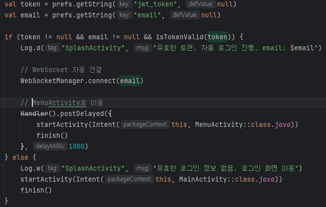
- 앱 시작 시 SharedPreferences에 저장된 JWT 토큰(첫 로그인시 발급해 앱 내 저장소에 저장)과 사용자 이메일을 조회
- JWT Payload의 exp 값을 디코딩하여 토큰 만료 여부를 직접 검증
- 유효한 토큰일 경우 별도 로그인 과정 없이 자동 로그인 수행
- 로그인 성공 시 WebSocket을 자동 연결하여 서버와 실시간 통신 준비

---

### 서버 호스팅
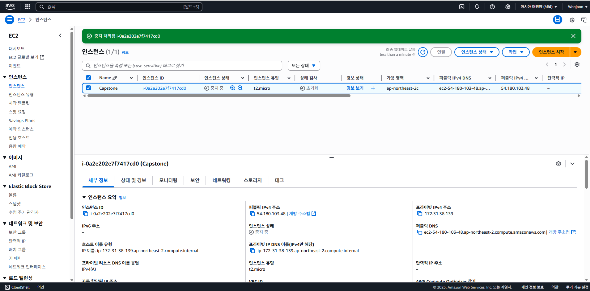
- AWS EC2 인스턴스를 통해 글로벌 서비스가 가능
- 애플리케이션과 서버는 aws에 호스팅된 퍼블릭 IP주소를 통해 상호 연결할 수 있음

---

### 애플리케이션 구성도
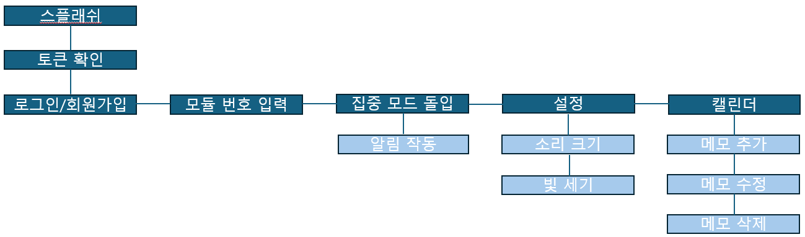

---

### 애플리케이션 디자인
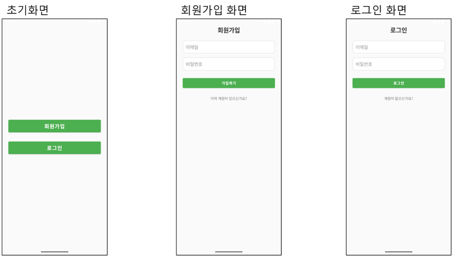
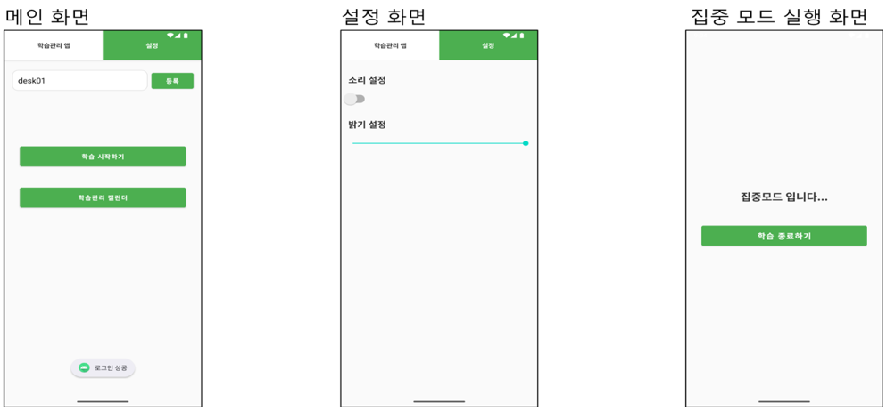
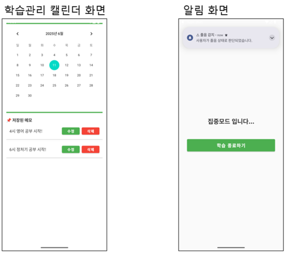

